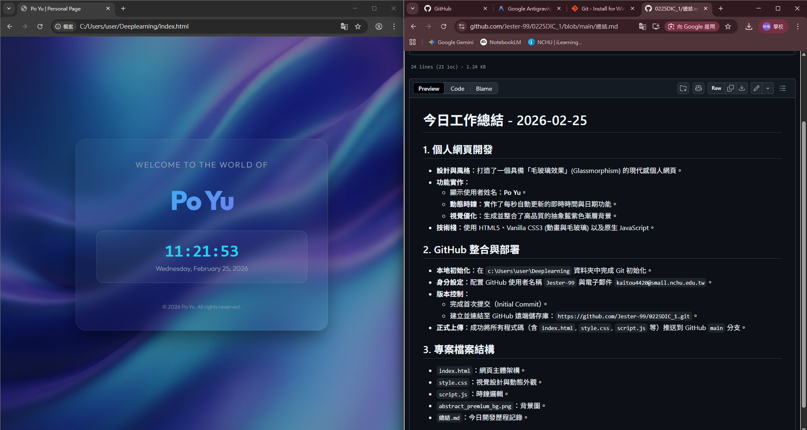

# 今日工作總結 - 2026-02-25

## 1. 個人網頁開發
- **設計與風格**：打造了一個具備「毛玻璃效果」(Glassmorphism) 的現代感個人網頁。
- **功能實作**：
    - 顯示使用者姓名：**Po Yu**。
    - **動態時鐘**：實作了每秒自動更新的即時時間與日期功能。
    - **視覺優化**：生成並整合了高品質的抽象藍紫色漸層背景。
- **技術棧**：使用 HTML5、Vanilla CSS3 (動畫與毛玻璃) 以及原生 JavaScript。

## 2. GitHub 整合與部署
- **本地初始化**：在 `c:\Users\user\Deeplearning` 資料夾中完成 Git 初始化。
- **身分設定**：配置 GitHub 使用者名稱 `Jester-99` 與電子郵件 `kaitou4420@smail.nchu.edu.tw`。
- **版本控制**：
    - 完成首次提交（Initial Commit）。
    - 建立並連結至 GitHub 遠端儲存庫：`https://github.com/Jester-99/0225DIC_1.git`。
- **正式上傳**：成功將所有程式碼（含 `index.html`, `style.css`, `script.js` 等）推送到 GitHub `main` 分支。

## 3. 專案檔案結構
- `index.html`：網頁主體架構。
- `style.css`：視覺設計與動態外觀。
- `script.js`：時鐘邏輯。
- `abstract_premium_bg.png`：背景圖。
- `image.png`：截圖紀錄。
- `總結.md`：今日開發歷程記錄。

## 4. Demo 連結
您可以透過以下網址直接瀏覽網頁：
👉 [**Po Yu 個人網頁 Demo**](https://jester-99.github.io/0225DIC_1/)

## 5. 專案預覽

## 6. 後續維護與進度 (2026-03-04)
- **紀錄整理**：完成了開發歷程與歷史對話的系統化整理。
- **文件更新**：新增了 `DEVELOPMENT_LOG.md` 以追蹤長期的開發動態。

---
*詳細開發歷程請參考 [DEVELOPMENT_LOG.md](./DEVELOPMENT_LOG.md)*
